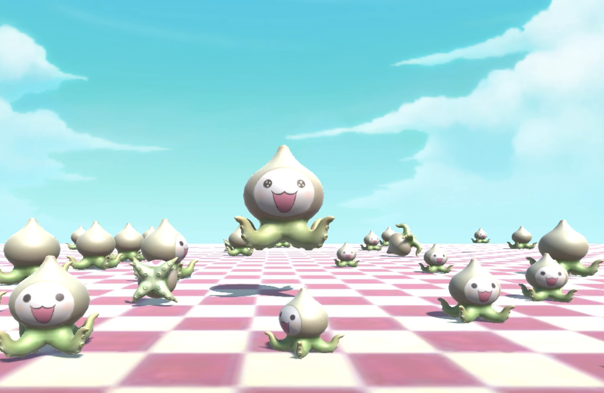

# Pachikatamari (パチ塊)

## Descripton 

Idea based on a pun

A 3D game that combines: 
- Overwatch's Pachimari (パチマリ, /patɕimaɺi/), a Japanese plush of a half-onion, half-octopus creature. 
- & Katamari Damacy's katamari (塊), a sticky clump that picks up objects. 

In this game, the player controls a Pachimari (which acts as the katamari) and rolls it around to pick up other pachimari plushies. 

  

## Rules

1. Falling off the platform will result in game over, and the game will automatically restart
2. The more pachimari plushies that are picked up, the faster the katamari clump will roll, making it easier to move around but more difficult to stay on the platform
3. The camera angle is still so be careful of where to roll 

## Code

Made with Unity Engine 

Improved functionalties, movement, and game design are welcomed

## Sources 

- [Free 3D Pachimari model](https://www.cgtrader.com/free-3d-models/character/fantasy-character/pachimari-fan-art).
- Free Skybox from Unity assets store
